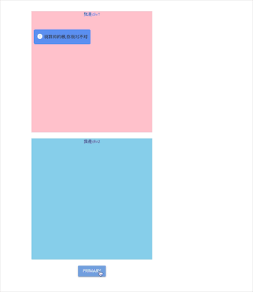

# Toast for Vue

## 起因

​	 已经有很多toast插件了，为啥我还要再造轮子了，除了是锻炼自己的技术外，也是项目需要，现在很多toast不能在特定的位置上展示，只能挂载上body上，于是乎就产生了自己写一个toast的想法。

## 展示效果



[在线网址](http://meyeyong.top/)

## 优点

​	来一波王婆卖瓜：

​		1、可以挂载到指定的dom上

​		2、使用单例模式，避免不必要的开销

​		3、简单使用

​		4、编不下去了。。。。

## 使用

### 在Vue中使用

```javascript
// main.js
import Vue from 'vue'
import App from './App.vue'
import './quasar'
import Toast from 'm-toast-vue'

Vue.use(Toast)

Vue.config.productionTip = false

new Vue({
  render: h => h(App),
}).$mount('#app')
```

```vue
// xxx.vue
<template>
  <div id="app">
    <div class="div1">我是div1</div>
    <div class="div2">我是div2</div>
    <q-btn color="primary" label="Primary" @click="showToast"/>
  </div>
</template>

<script>
export default {
  name: 'App',
  components: {
  },
  methods:{
    showToast(){
      const type = ['success','error','info'][Math.ceil(Math.random()*3-1)]
      this.$toast({
        message:'上帝说我帅的很,你说对不对'.slice(Math.ceil(Math.random()*10)),
        domStr:['.div2','.div1'][Math.ceil(Math.random()*2-1)],
        duration: 3000,
        type: type,
        position:['top','top-right','top-left','bottom','bottom','bottom-right','bottom-left'][Math.ceil(Math.random()*7-1)],
      })
    }
  }
}
</script>

<style lang='less'>
#app {
  font-family: Avenir, Helvetica, Arial, sans-serif;
  -webkit-font-smoothing: antialiased;
  -moz-osx-font-smoothing: grayscale;
  text-align: center;
  color: #2c3e50;
  margin-top: 60px;
 .div1, .div2{
   position: relative;
   margin: 0 auto;
   width: 400px;
   height: 400px;
   margin-bottom: 20px;
 }
 .div1{
   background: pink;
 }
 .div2{
   background: skyblue;
 }
}
 
</style>

```

​	这样就可以通过`this.$toast`全局使用了。

### 在js中使用

```javascript
import Toast from 'm-toast-vue'
Toast({
	...
})
```

## 参数

| 参数             | 说明          | 可选项                                                       |
| ---------------- | ------------- | ------------------------------------------------------------ |
| message: String  | 提示信息      |                                                              |
| domStr: String   | 需要挂载的dom | class用：.xxx ;id用：#xxx                                    |
| duration: Number | 显示时间      |                                                              |
| type: String     | 消息类型      | 'success','error','info'                                     |
| position:String  | 显示位置      | 'top','top-right','top-left','bottom','bottom','bottom-right','bottom-left' |

